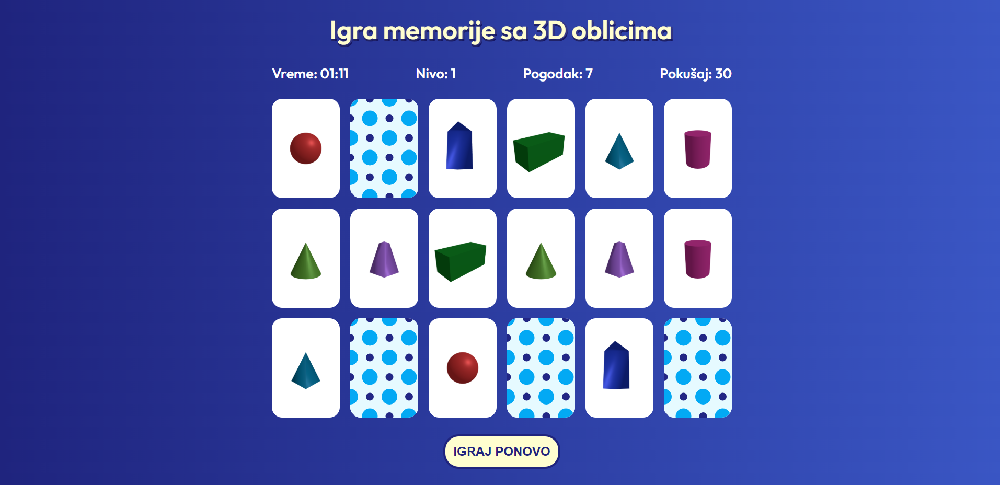

# Educational Memory Game

This application is an educational memory game that helps students practice attention and learning by revealing 3D geometric shapes. It is built with **HTML**, **CSS**, **JavaScript** and **Three.js**.

## Live Preview

Check out the live app here:  
https://adrianav1999.github.io/memory-card-game/

## Features

- Three difficulty levels with different time limits:
  - Level 1 — 120 seconds
  - Level 2 — 90 seconds
  - Level 3 — 60 seconds
- 9 pairs of cards per level.
- If the user does not complete a level in time, the game restarts from the beginning.
- When the user finds a matching pair, information about the 3D geometric shape is displayed:
  - Shape name
  - Shape image
  - Shape composition
- Cards are shown as **3D geometric shapes** created with **Three.js**.

## Structure

**memory-card-game/**
 - **assets/** – images 
 - **data/cards.json** – information about 3D shapes  
 - **index.html** – main HTML file  
 - **index.css** – stylesheet  
 - **index.js** – game logic & Three.js objects  

## Technologies Used

- **HTML** — Page and element structure.
- **CSS** — Styling and layout.
- **JavaScript** — Game logic, timer, match checking and interactivity.
- **Three.js** — Creation and display of 3D geometric shapes on cards.

## Installation / How to Run

To run this project locally:

1. Clone the repository:

   #### `git clone [https://github.com/AdrianaV1999/memory-card-game.git]`

2. Navigate into the project folder:

   #### `cd memory-card-game`

3. Open `index.html` in a web browser, or run a local server:

   #### Using VS Code: Install **Live Server** extension and click "Go Live"  
   #### Using Terminal: Run `http-server` or any local server command

---

This project demonstrates **3D graphics**, interactivity, and educational value through a simple game.
